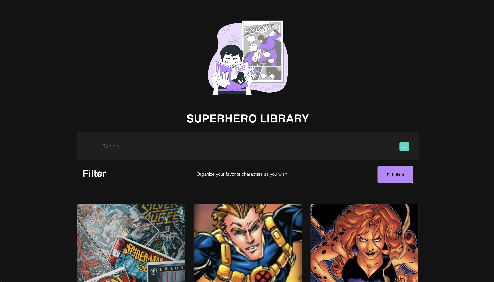

# SUPERHERO LIBRARY



## Contenidos

1. [Ejecutar Proyecto](#ejecutar-proyecto)
2. [Componentes](#componentes)
3. [Tecnologías](#tecnologías)
4. [GitFlow](#gitflow)

## Ejecutar Proyecto

Para poder correr este proyecto es necesario crear un archivo `.env` que contiene las variables de entorno necesarias para su correcto funcionamiento.

```sh
REACT_APP_ACCESS_TOKEN=4037388883008600
REACT_APP_API=https://superheroapi.com/api/
REACT_APP_PROXY=https://thingproxy.freeboard.io/fetch/
```

### Scripts disponibles

#### `npm install`

Instalar todas las dependencias necesarias.

#### `npm start`

Corre la aplicación en modo de desarrollo.
Abre [http://localhost:3000](http://localhost:3000) para visualizarlo en el navegador.

#### `npm build`

Contruye la aplicación preparandola para entornos de producción en el directorio `build`.

## Componentes

**src/components/atoms/ButtonStyled/index.tsx**

#### ButtonStyled

ButtonStyled componente UI personalizado referente a un botón con la posibilidad de agregar un icono.

@typedef {ButtonProps} ButtonStyledProps uso de las props nativas de un botón
@param {string} text
@param {string} icon opcional
@param {string} statusButtonColor opcional

Uso:

```js
<ButtonStyled text="Load more..." onClick={toggle} />
```

---

**src/components/atoms/Card/index.tsx**

#### CardHero

CardHero muestra la portada inicial del superheroe: Foto, Nombre, ocupación.
En caso de que la imagen no sea cargada muestra una alternativa por defecto.

@param {string} image
@param {string} name
@param {string} work
@typedef {IAppearance} appearance
@typedef {IPowerstats} powerstats

Uso:

```js
<CardHero
  image={superhero.image.url}
  name={superhero.name}
  work={superhero.work.occupation}
  appearance={superhero.appearance}
  powerstats={superhero.powerstats}
/>
```

---

**src/components/atoms/ModalHero/index.tsx**

#### ModalHero

ModalHero componente modal que muestra la información de apariencia y habilidades del personaje.
El componente verifica que la infomación recibida por el servicio se user friendly en caso contrario muestra que el dato del personaje es desconocido.

@typedef {IAppearance} appearance
@typedef {IPowerstats} powerstats
@param {boolean} modal
@param {function} toggle
@param {string} name
@param {string} image

Uso:

```js
<ModalHero
  modal={modal}
  toggle={toggle}
  name={name}
  appearance={appearance}
  powerstats={powerstats}
  image={image}
/>
```

---

**src/components/atoms/MultiSelect/index.tsx**

#### MultiSelect

MultiSelect es un componente personalizado basado en select option

@param {string} label Título del select
@typedef {InputProps} MultiSelectProps Todas las propiedades nativas de un select están a disposición de uso

Uso:

```jsx
<MultiSelect
  label="Order by powerstats"
  onChange={(value) => filterPowerstats(value.target.value)}
  defaultValue={'DEFAULT'}
>
  <Option value="DEFAULT">Open this select powerstats</Option>
</MultiSelect>
```

---

**src/components/atoms/ProgressBar/index.tsx**

#### ProgressBar

ProgressBar muestra una gráfica por habilidad

@param {string} title
@param {string} powerstats
@param {string} color
Uso:

```js
<ProgressBar title="Durability" powerstats="50" color="indigo" />
```

---

**src/components/atoms/Skeleton/index.tsx**

#### SkeletonList

SkeletonList es un componente UI que muestra una lista de ejemplo como Loading mientras se realiza la petición del servicio.

Uso:

```js
<SkeletonList />
```

---

**src/components/molecules/Content/index.tsx**

#### Content

Content layout permite anidar el componente padre con el diseño base, como fondo.

@param {React.ReactNode} children

Uso:

```html
<content>contenido de la página</content>
```

---

**src/components/molecules/Feed/index.tsx**

#### Feed

Feed se encarga de renderear la lista de heroes almacenadas en el reducer `superheroReducer`

Uso:

```js
<Feed />
```

---

**src/components/molecules/Filter/index.tsx**

#### Filter

Filter se encarga de mostar los selects para que el usuario pueda escoger su opción a filtar.

@param {function} filterPowerstats función a la que se le envia el parametro seleccionado y realiza el ordenamiento por habilidades respectivo
@param {function} filterAppearance función a la que se le envia el parametro seleccionado y realiza el ordenamiento por apariencia respectivo

Uso:

```html
<Filter filterPowerstats="{orderFilterPowerstats}" filterAppearance="{orderFilterByAppearance}" />
```

---

**src/pages/Home/index.tsx**

#### Home

Componente Home padre y pantalla inicial de la SPA.
Se encarga de listar los superheroes iniciales sin ningún dato de busqueda previamente usado.

Uso:

```html
<Home />
```

## Tecnologías

Este proyecto está realizado con las siguientes tecnologías:

- [React.js](https://github.com/facebook/create-react-app).
- TypeScript
- Styled Components
- React Hook Form
- Redux

## GitFlow

Este proyecto se trabajó con el workflow `GitFlow`. Donde la rama de `develop` es una de las ramas principales y cada `feature/*` que se realize se hace un merge por `Pull Request`a esta misma. Dejando `main`como rama de producción.
